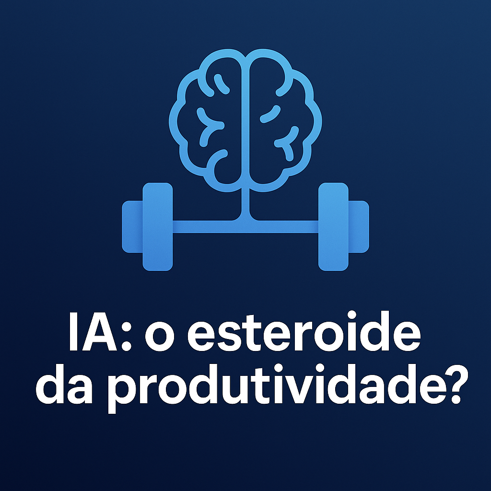

# 📘 **IA: O Esteroide da Produtividade?**

#### Um Tratado Acadêmico sobre Aceleração Cognitiva, Potência Simbólica e Limites Humanos

---

# 

> *“A IA não substitui sua mente — ela expõe sua mente.”*
> — Autor 

---

# Sumário

1. Fundamentos da metáfora
2. Paralelo biológico vs. cognitivo
3. Efeito HALO
4. Mitos da aceleração
5. Competência estrutural
6. Estudos de caso
7. Ganhos reais vs ilusões
8. Profissional turbo vs inflado
9. Framework A.C.E.L.E.R.A
10. Exercícios acadêmicos
11. Modelos de prompt
12. Checklists
13. Filosofia da tecnologia
14. Cognição humana vs IA
15. Ética
16. Limites da metáfora
17. Impactos na educação
18. Glossário
19. Referências
20. Neurociência
21. Psicologia Cognitiva
22. Criatividade
23. História dos Amplificadores
24. Exercícios avançados
25. Síntese final

---

# PREFÁCIO ACADÊMICO

A inteligência artificial generativa alterou profundamente o modo como humanos produzem conhecimento. Este texto se propõe a analisar, com rigor acadêmico e profundidade filosófica, a metáfora da IA como “esteroide da produtividade”, entendida como **um amplificador cognitivo externo** que acelera e expande capacidades humanas, sem substituí-las.

Este é um livro sobre potência, não sobre mágica.
Sobre limites, não sobre hype.
Sobre disciplina e profundidade.

---

# CAPÍTULO 1 — Fundamentos da Metáfora: Por que IA = Anabolizantes?

A metáfora funciona por três razões:

## 1. Aceleração de resultados

Ambos ampliam o que já existe.

## 2. Amplificação da base

Quanto melhor o atleta/profissional → maior o ganho.

## 3. Dependência funcional

Ambos criam o risco de um “atalho psicológico”.

A questão central é:
**quem você se torna quando usa a IA?**

---

# CAPÍTULO 2 — O Paralelo Biológico vs. Cognitivo

## Biologia (anabolizantes)

* Aumentam síntese proteica
* Reduzem recuperação
* Potencializam treino

## Cognição (IA)

* Reduz carga mental
* Estrutura ideias
* Acelera escrita e análise
* Amplia criatividade combinatória

**Sem treino → anabolizante não faz nada.
Sem clareza → IA não faz nada.**

---

# CAPÍTULO 3 — Efeito HALO Cognitivo

A IA gera outputs limpos, coerentes e bem formatados, criando a ilusão de:

* domínio
* profundidade
* expertise

Mas **fluência textual ≠ compreensão real**.

O mesmo ocorre com atletas dopados que parecem fortes, mas não dominam técnica.

---

# CAPÍTULO 4 — Mitos da Aceleração

### Mito 1 — “Basta tomar que cresce”

Não cresce. Cresce errado ou não cresce.

### Mito 2 — “Basta pedir que a IA faz”

Ela faz *algo* — não necessariamente o que você queria.

---

# CAPÍTULO 5 — Competência Estrutural: Base, Técnica e Protocolo

### BASE

Conhecimento real.

### TÉCNICA

Como você usa IA (prompting, validação, refinamento).

### PROTOCOLO

Consistência — a parte mais negligenciada.

---

# CAPÍTULO 6 — Estudos de Caso Acadêmicos

### Caso 1 — Estudante superficial

IA acelera → mas sem base, gera textos ocos.

### Caso 2 — Pesquisador treinado

IA acelera → e o pesquisador valida → explosão de performance.

### Caso 3 — Escritor criativo

IA remove bloqueios → escritor direciona → sinergia.

---

# CAPÍTULO 7 — Ganhos Reais vs. Ilusões

### Ganhos reais:

* Velocidade
* Clareza
* Consistência
* Criatividade
* Produção em dias ruins

### Ilusões:

* Parecer mais inteligente
* Parecer mais criativo
* Parecer mais técnico

---

# CAPÍTULO 8 — Profissional Turbo vs. Inflado

### Turbo

Usa IA como exoesqueleto cognitivo.

### Inflado

Depende da IA para tudo.

**A IA revela quem você é.**

---

# CAPÍTULO 9 — Framework A.C.E.L.E.R.A.

**A — Analisar**
**C — Contextualizar**
**E — Especificar**
**L — Lapidar**
**E — Expandir**
**R — Revisar**
**A — Aplicar**

Um framework simples e poderoso.

---

# CAPÍTULO 10 — Exercícios Acadêmicos

1. Identificar ilusões de competência
2. Analisar dependência cognitiva
3. Criar sínteses sem IA
4. Fazer contra-argumentos
5. Testar profundidade sem suporte

---

# CAPÍTULO 11 — Modelos de Prompt

### Prompt para análise crítica:

> Gere argumentos contrários à tese X, identifique pressupostos e proponha contraexemplos.

### Prompt para síntese:

> Compare X e Y sob a ótica de impacto, mecanismos e limitações teóricas.

---

# CAPÍTULO 12 — Checklists

### Checklist epistemológico:

* É consistente?
* Tem evidência?
* Tem lógica interna?
* Tem vieses?

### Checklist de profundidade:

* Vai além do óbvio?
* Conecta conceitos?
* Propõe síntese?

---

# CAPÍTULO 13 — Filosofia da Tecnologia

IA como:

* prótese cognitiva
* exoesqueleto mental
* extensão simbólica
* ferramenta existencial

Toda tecnologia transforma seu usuário.

---

# CAPÍTULO 14 — Cognição Humana vs IA

Humanos:

* consciência
* intenção
* autocorreção
* subjetividade
* imaginação

IA:

* correlação
* recombinação
* estatística
* probabilidade

---

# CAPÍTULO 15 — Ética do Uso da IA

Tópicos:

* desigualdade cognitiva
* autoria
* originalidade
* dependência
* transparência acadêmica

---

# CAPÍTULO 16 — Limites da Metáfora

* IA não é química
* IA não é fisiologia
* IA acelera criatividade — esteroides não
* IA não causa dano físico

---

# CAPÍTULO 17 — Impactos na Educação

* professores → facilitadores
* estudantes → curadores
* exames → reformulados
* pesquisas → aceleradas

---

# CAPÍTULO 18 — Glossário Acadêmico

Inclui termos como:

* amplificação cognitiva
* externalização
* predição
* síntese semântica
* performatividade

---

# CAPÍTULO 19 — Referências Bibliográficas Sugeridas

Autores:

* Bostrom
* Harari
* Clark
* Dennett
* Chalmers
* Carr
* Kurzweil

---

# CAPÍTULO 20 — Neurociência

* carga cognitiva
* neuroplasticidade
* economia energética
* exaustão do córtex
* IA como suporte regulador

---

# CAPÍTULO 21 — Psicologia Cognitiva

* ilusão de fluência
* efeito Google
* vieses amplificados
* dependência de heurísticas

---

# CAPÍTULO 22 — Criatividade Humana vs IA

IA recombina.
Humanos transcendem.

Ambos juntos → explosão de possibilidades.

---

# CAPÍTULO 23 — História dos Amplificadores Cognitivos

* escrita
* livros
* matemática
* método científico
* computadores
* internet
* IA

A IA é o amplificador mais profundo desde a escrita.

---

# CAPÍTULO 24 — Exercícios Avançados

* raciocínio de segunda ordem
* expansão conceptual
* teste de independência cognitiva
* autocrítica sistemática

---

# CAPÍTULO 25 — Síntese Final

**A IA não substitui sua mente.
Ela revela sua mente.**

Assim como esteroides mostram quem treina de verdade,
a IA mostra quem pensa de verdade.

Ela é multiplicador — não substituto.

---

# Sobre o Autor
Especialista em tecnologia educacional e filosofia da mente, o autor dedica sua carreira a explorar como ferramentas cognitivas transformam o pensamento humano. Com formação em neurociência e ciência da computação, ele combina rigor acadêmico com uma visão prática sobre o uso ético e eficaz da inteligência artificial na ampliação das capacidades humanas.

# Créditos da Capa
Design de Capa por [Chat GPT-4 e DALL·E 3]
Imagem de Capa por [Prompt criado pelo autor]
# Agradecimentos
Agradeço a todos os colegas acadêmicos, revisores e mentores que contribuíram com insights valiosos para a elaboração deste tratado. Sua expertise e críticas construtivas foram fundamentais para aprimorar o conteúdo e garantir sua relevância no campo da inteligência artificial e produtividade cognitiva.

